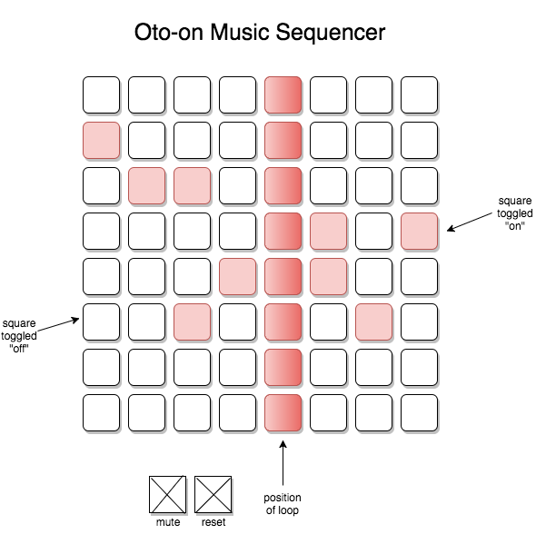

# Oto-on

## Background

Inspired by Yamaha's Tenori-on, this project is a music sequencer built using JavaScript and CSS. This audio step sequencer will allow users to add notes to a musical sequence.

It will be created using JavaScript, jQuery, HTML/CSS, and Howler.js.

## Functionality & MVP

With this music sequencer, users will be able to:

- [ ] Click on a grid square to add/remove notes
- [ ] Automatically loop through music notes
- [ ] Reset the loop
- [ ] Mute the music

In addition, this project will include:
- [ ] Effects and visualization of notes and sound loop
- [ ] A production README

## Wireframes

This app will consist of a single screen with a grid of notes, app controls, and links to my Github and LinkedIn. The loop will run in the background upon initialization, and users will click on individual squares or click and drag over multiple squares to add notes to the loop.

## Architecture and Technologies

This project will be implemented using the following technologies:

* Vanilla JavaScript and jQuery for overall structure and logic
* Howler.js audio library to sequence and play sounds
* Webpack to bundle and serve various scripts

In addition to the Webpack entry file, there will be two scripts involved in this project:

`board.js`: this script will handle the logic for creating and updating the necessary `Easel.js` elements and rendering them to the DOM.

`audio.js`: this script will handle the logic for toggling squares and playing audio.

## Implementation Timeline

**Day 1**:
- Setup all necessary Node modules, webpack, and `Easel.js`.
- Create `webpack.config.js` and `package.json`.

**Day 2**:
- Learn `Easel.js` and build board.
- Begin learning `Howler.js` library.

**Day 3**:
- Create the logic for adding notes and looping.  
- Build functional board.

**Day 4**:
- Create controls for resetting loop and muting music.
- Style board and make app look polished and professional.

## Bonus Features

- Import/export audio to save it for later
- Slider for changing tempo
- Option for different visual effects
