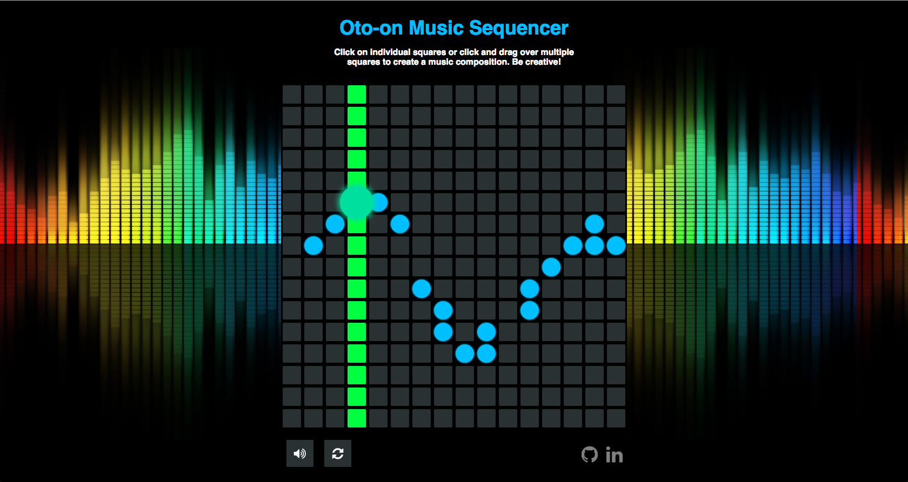

# Oto-on

[Live Site][github]

[github]: https://samwzz.github.io/oto-on/

Inspired by Yamaha's Tenori-on, Oto-on is a music sequencer built using JavaScript and CSS. This audio step sequencer will allow users to add notes to a musical sequence.



## Technologies

Oto-on utilizes the following technologies:

* Vanilla JavaScript for overall structure and logic, no jQuery or external libraries
* HTML/CSS for audio and visual effects
* Webpack to bundle and serve various scripts

## How to Play

The loop will run in the background upon initialization,indicated by the moving bar. Users can click on individual squares or click and drag over multiple squares to add notes to the loop. Be creative!
(Users can mute the sound and reset the board through the app controls near the bottom.)


## Technical Implementation Details

Uses callbacks and asynchronous functions to loop through notes at a specific tempo and to display which notes are being played and where the current beat is.

```js
let currBeat = 0;

const play = () => {
  let currCol = document.querySelectorAll(`.col-${currBeat}`);

  for (let i = 0; i < currCol.length; i++) {
    currCol[i].classList.toggle("playing");

    if (currCol[i].classList.contains("active")) {
      currCol[i].classList.add("pulse");
      let soundId = currCol[i].getAttribute("sound-id");
      let note = document.getElementById(soundId);

      if (!note.muted) {
        const tempNote = note.cloneNode(true);
        tempNote.play();
      }
    }

    setTimeout(() => {
      currCol[i].classList.toggle("playing");
      currCol[i].classList.remove("pulse");
    }, 200);
  }
};

setInterval(() => {
  play();
  currBeat = (currBeat + 1) % 16;
}, 200);
```

## Future Features for the Project

- [ ] Utilize Web Audio API to generate sounds
- [ ] Import/export audio to save it for later and to share with friends
- [ ] Slider for changing the tempo
- [ ] Option for different visual effects
